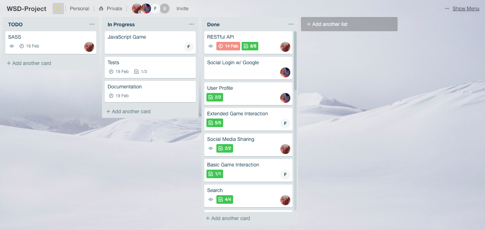

# wsd2018-project

### 1. Team

* Sataponn Phutrakul — [@nropatas](https://github.com/nropatas)
* Ekaterina Shmeleva — [@shmeleva](https://github.com/shmeleva)
* Felipe Gonzalez Carceller — [@speedyjr](https://github.com/speedyjr)

### 2. Goal

The goal is to develop an online game store where *(1)* developers can publish and sell games and view statistics for games and *(2)* players can search for games, purchase games via an online payment system, launch and play games, leave public comments for developers and other players, and view leaderboards for individual games.

### 3. Features

#### 3.1 Basic Features

##### Authentication

**_200 points_**

* Signing in and logging in and out are implemented with the [Django authentication system](https://docs.djangoproject.com/en/2.1/topics/auth/);
* We send a verification link to the email address used to sign up using [console backend](https://docs.djangoproject.com/en/2.1/topics/email/#console-backend) during development and [SendGrid](https://sendgrid.com/) in production. The user must verify the email address before they can access their account.
* We also integrated Google sign-in into the app (*see 3.2*).

##### Player Functionalities
**_300 points_**

Players can:
* Search games and filter games by genre and ownership, which is implemented with AJAX so that the user does not have to press the _Search_ button for filtering search results and the page is not reloaded every time the user refines their search results;

* Purchase games via an online payment system;
* Launch and play games;
* View leaderboards for individual games;
* View their own latest and high scores for individual games;
* Leave public Facebook comments and share games on social media (*see 3.2*).

##### Security
* Players are only able to play games they have purchased: however, we deliberately do not protect against accessing games through their URL as it is not included in the scope of this project;
* Players are not able to publish games;
* Etc.

##### Developer Functionalities
**_200 points_**

Developers can:

* Publish, remove and manage games, including setting and making changes to its URL, description, categories, image and price;
* View sales statistics including _a revenue graph_, which is implemented with [FusionCharts](https://www.fusioncharts.com), and detailed game purchases (pending, canceled, failed, successful).

##### Security
* Developers can only view, modify and access statistics of their own games and are not be able to impersonate other developers;
* Developers cannot play games;
* Etc.

##### Game Interactions
**_200 points_**
* The game runs in the `iframe`. Once it is over, the score is posted from the `iframe` that holds the game to its parent with the `window.postMessage()`. Then, the score is posted to the backend using AJAX. The latest and high personal scores and global high scores are updated accordingly.

##### Quality of Work
**_90 points_**
* We did not comment each and every line because good code should be self-documenting and that is what we were trying to achieve. Yet, we use comments where necessary, e.g. for providing a description for methods.
* In order to allow better modularity, we use separate applications for different models, e.g. `games` for `Game` model, `purposes` for `Purchase` model, etc. All logic, forms, templates, styles are placed in corresponding applications. Furthermore, we have an additional application for RESTful API.
* In order to achieve better code reusability, we use custom `Manager`s and `QuerySet`s for querying games, purchases and results.
* We include and extends templates to achieve better reusability and readability. For example, all the pages contain the same navbar — we use template inheritance for that; the _Game_ page contains a couple of different logical blocks (description, leaderboards) that are defined in separate files and included in the main template. We also use _template tags_ for the _Game_ action button (_Buy_, _Play_, _Manage_) that can be reused in multiple templates.
* A substantial part of application logic is located in `QuerySet`s, not in views. This applies, for example, to the _Search_ and _Sales Statistics_. The same code is reused in different views and RESTful API.
* The UI is mobile-friendly (*see 3.2*). For the UI, we selected a dark theme and an [Anonymous Pro](https://fonts.google.com/specimen/Anonymous+Pro) font which seamed appropriated for an online game store. We also used icons provided by [Font Awesome](https://fontawesome.com/). All features are logically organized and easily accessible.

  
* We used [`w3c-validation`](https://atom.io/packages/w3c-validation) package for Atom text editor for _validating HTML and CSS files_.
* While _testing our responsive design_, we used both physical mobile devices and Google Chrome developer tools for emulating a variety of screen sizes.
* All modules of the application were tested manually. These tests included _penetration tests_. We _did not_ use automated unit testing.

##### Non-Functional requirements
**_200 points_**

We mostly communicated using [Telegram](https://telegram.org/) and, additionally, we were meeting in person for a discussion at least once week or more often, if it was required. Sometimes we were meeting to work together for the whole day.

We first started working on mandatory features. At each stage, we divided tasks among team members, so that everyone knew what they should work on next. [Trello](https://trello.com) was used to create, define, assign, and track tasks:

#### 3.2 Extra Features

##### Save / Load and Resolution Feature
**_100 points_**

* The service supports saving and loading for games with the simple message protocol described in _Game Developer Information_.
* The service is able to receive additional style settings which are then applied to the `iframe`.

##### Social Login
**_100 points_**

* Google sign-in is added as an alternative to the standard email registration using [social-auth-app-django](https://github.com/python-social-auth/social-app-django).

##### RESTful API
**_100 points_**

* We implemented an API with [Django REST framework](https://www.django-rest-framework.org/). The API provides the following methods:
  * A public `GET api/v1/games?search=<search>&categories=<category1,category2>` method for searching games by a keyword and categories;
  * A public `GET api/v1/game/<int:id>` method for retrieving information about a specific game;
  * A public `GET api/v1/game/<int:id>/scores` method for retrieving high scores for individual games;
  * A private `GET api/v1/dev/sales` method for retrieving game sale statistics;
  * A private `GET api/v1/dev/revenue` method for retrieving game sale revenue.
* Private API can only be accessed with a developer API access token.

##### Own game
**_100 points_**

* A simple _Breakout_ game written in JavaScript;
* The game is able to communicate with the service using `postMessage`. The score is saved once the player loses, the current game progress can be saved and the latest saved game state can be loaded from the backend.

##### Social Media Sharing
**_50 points_**

* We use [ShareThis](https://www.sharethis.com/) for social sharing. The user can share a game, including its title, image, description, and URL, which is achieved by using Open Graph and [Twitter Cards](https://developer.twitter.com/en/docs/tweets/optimize-with-cards/guides/getting-started) meta tags.

##### Mobile Friendly
**_50 points_**

* We build our application using [Bootstrap 4](https://getbootstrap.com/docs/3.3/) to support a variety of devices, including smartphones, tablets, and desktops. We also use [`django-crispy-forms`](https://django-crispy-forms.readthedocs.io/en/latest/) for displaying forms with Bootstrap.

##### Facebook Comments
* We use the [Facebook Comments Plugin](https://developers.facebook.com/docs/plugins/comments/) to let players comment on games.

### 4. The Good & the Bad

Overall, we were able to implement all the features that were mentioned in our initial design with some minor changes, e.g. implementing social login with Google, not Facebook.

It was sometimes difficult to figure out where to put a specific piece of code, so at first our project structure did not exactly follow the DRY and SoC principles and we then had to change it and move some code around. In the end, we still have some issues with that. Also, we did not use unit tests even though we probably should have. Some security (see _Player Functionalities_) and scalability issues exist but these lie outside of the scope of this project.

### 5. Who Did What

* Sataponn Phutrakul
  * Authentication, including email verification and social login with Google;
  * User settings, including password settings;
  * Payments;
  * Stats, including beautiful graphs.
* Ekaterina Shmeleva
  * Search, including filtering search results;
  * Personal and global high scores;
  * Game publishing, editing and removal;
  * Mobile-friendly markup and styles, including theming;
  * Social sharing and Facebook comments;
  * RESTful API, including token authentication.
* Felipe Gonzalez Carceller
  * Prototypes and basic page layout with the _Navbar_, _Sign up_ and _Log in_ buttons;
  * Game interaction, including extended functionalities;
  * Breakout — JavaScript game;
  * Testing.

We worked together on the initial design and final document, constantly communicated and helped each other during the project.

### 6. Models

We [extended](https://docs.djangoproject.com/en/dev/topics/auth/customizing/#extending-the-existing-user-model) the existing `User` model using a one-to-one link:

`UserProfile`
* `role`
* `verified`
* `user = models.OneToOneField(User, on_delete=models.CASCADE)`

`Game`
* `title`
* `image`
* `description`
* `price`
* `url`
* `developer = models.ForeignKey(UserProfile, on_delete=models.CASCADE)`
* `categories = models.ManyToManyField(Category)`

`GameState`
* `game_state`
* `game = models.ForeignKey(Game, on_delete=models.CASCADE)`
* `user = models.ForeignKey(UserProfile, on_delete=models.CASCADE)`

`Purchase`
* `user = models.ForeignKey(UserProfile, on_delete=models.CASCADE)`
* `game = models.ForeignKey(Game, on_delete=models.CASCADE)`
* `price`
* `timestamp`
* `status`

`Result`
* `user = models.ForeignKey(UserProfile, on_delete=models.CASCADE)`
* `game = models.ForeignKey(Game, on_delete=models.CASCADE)`
* `score`
* `timestamp`

`Category`
* `title`

### 7. Layout Sketch

We used [Marvel](https://marvelapp.com) to build a simple clickable prototype; it can be found [HERE](https://marvelapp.com/405c5bh) 👈

The thumbnail pictures are taken from [MINICLIP](https://www.miniclip.com/games/en/) and are only used for educational purposes.

### 8. Screenshots

