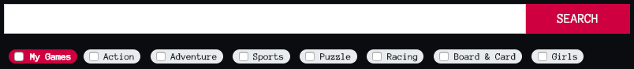
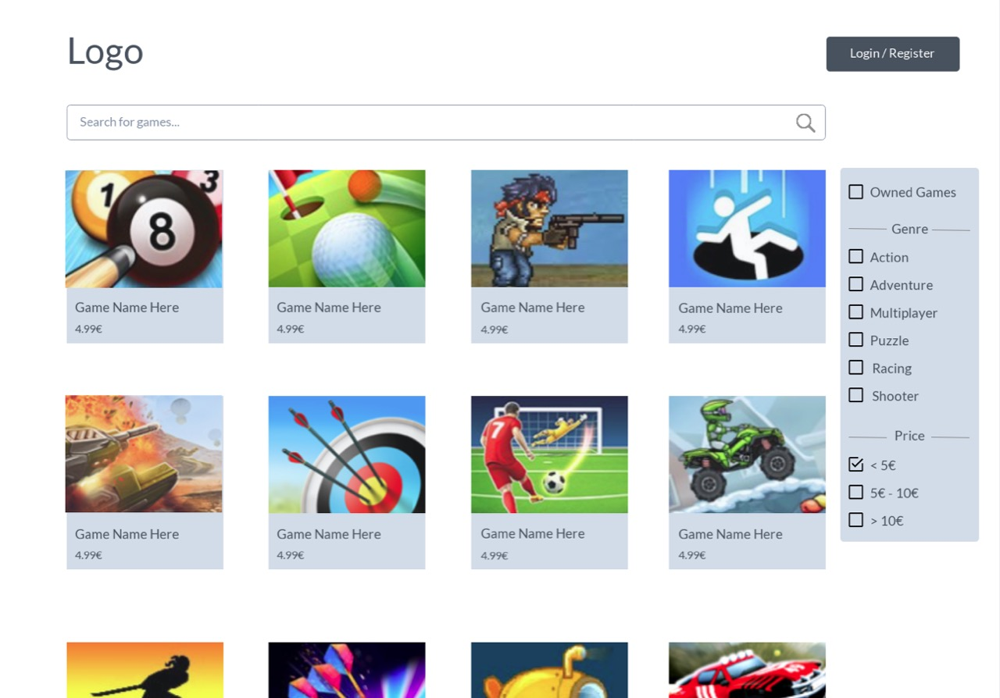
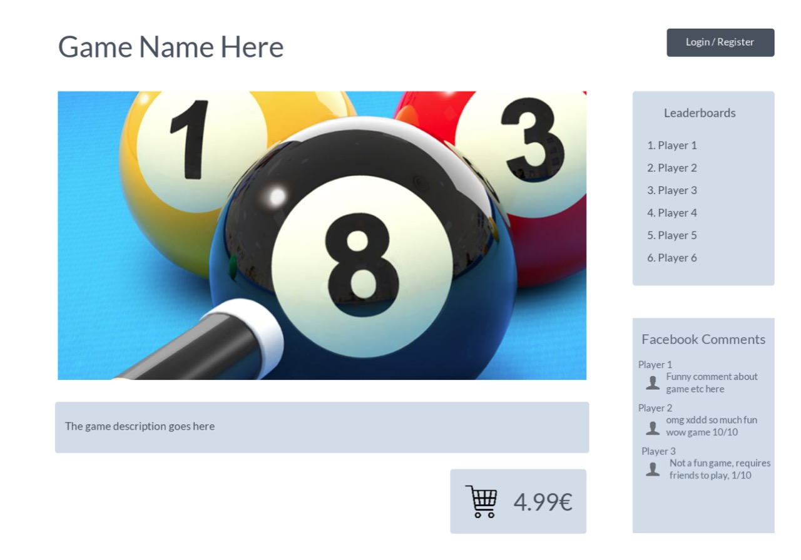
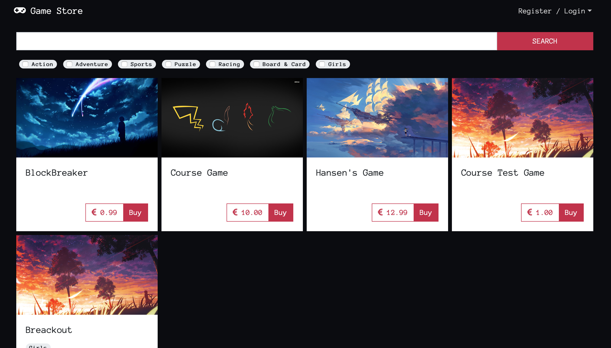
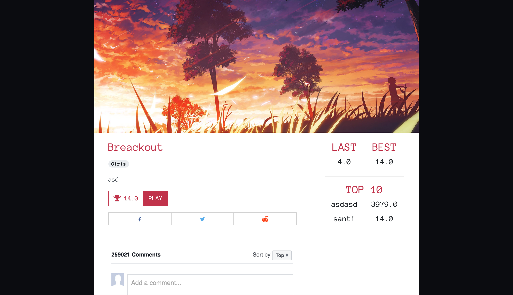
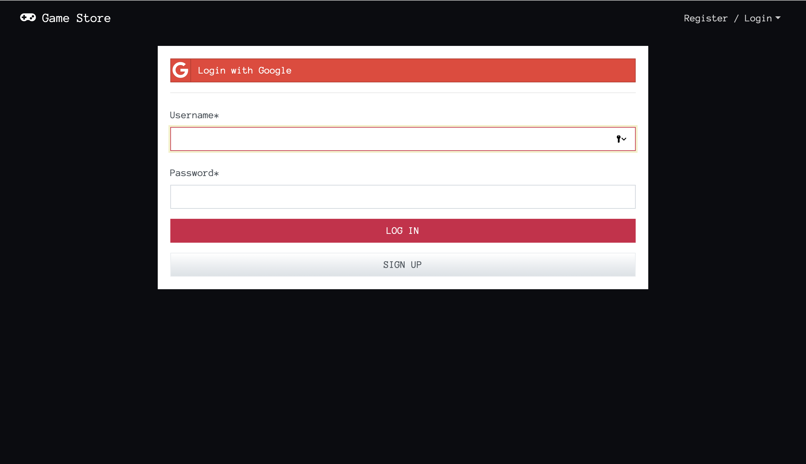
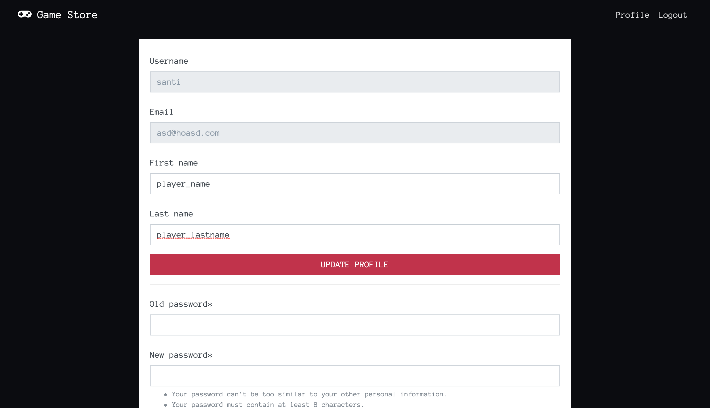
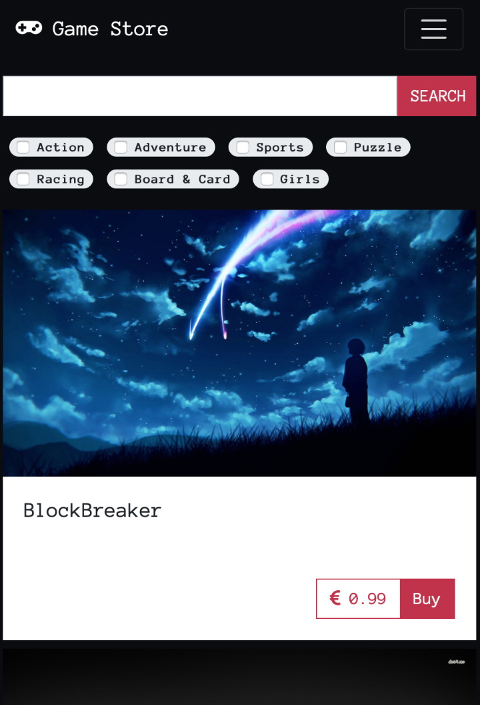
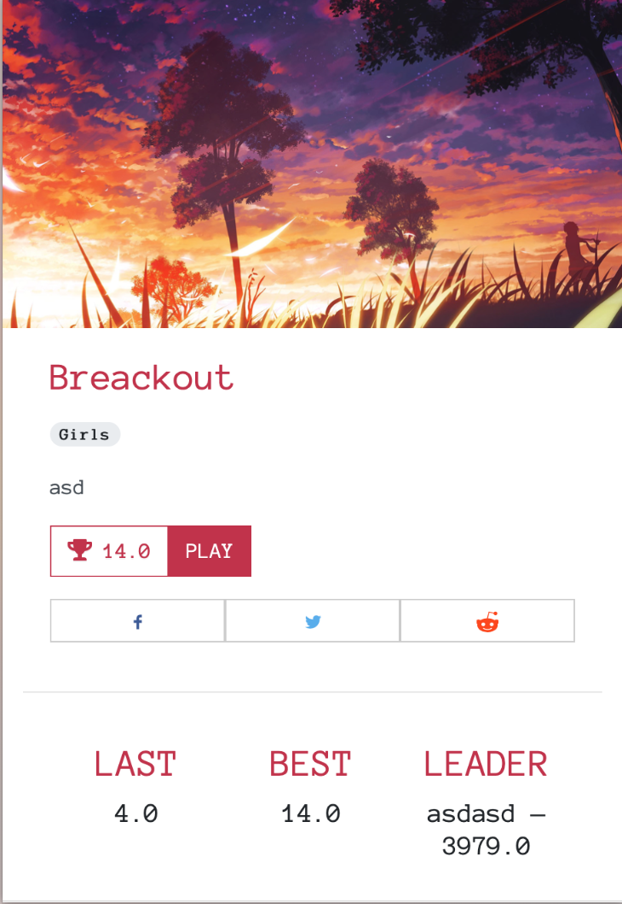

# wsd2018-project

### 1. Team

* `728010` Sataponn Phutrakul
* `721130` Ekaterina Shmeleva
* `528621` Felipe Gonzalez Carceller

### 2. Goal

The goal is to develop an online game store where *(1)* developers can publish and sell games and view statistics for games and *(2)* players can search for games, purchase games via an online payment system, launch and play games, leave public comments for developers and other players, and view leaderboards for individual games.

### 3. Features

#### 3.1 Basic Features

##### Authentication

**_200 points_**

* Signing in and logging in and out are implemented with the [Django authentication system](https://docs.djangoproject.com/en/2.1/topics/auth/);
* We send a verification link to the email address used to sign up using [console backend](https://docs.djangoproject.com/en/2.1/topics/email/#console-backend) during development and [SendGrid](https://sendgrid.com/) in production. The user must verify the email address before they can access their account.
* We integrated Google sign-in into the app (*see 3.2*).

##### Player Functionalities
**_300 points_**
* Search games and filter games by genre and ownership;

* Purchase games via an online payment system;
* Launch and play games;
* View leaderboards for individual games;
* View their own latest and high scores for individual games;
* Leave public Facebook comments and share games on social media (*see 3.2*).

##### Security
Players should only be able to play games they have purchased. We deliberately do not protect against accessing games through their URL as it is not included in the scope of this project.

##### Developer Functionalities
* 200 points;
* Publish, remove and manage games, including setting and making changes to its URL, description, categories, image and price;
* View sales statistics including a revenue graph ([FusionCharts](https://www.fusioncharts.com)) and detailed game purchases (pending, canceled, failed, successful).

##### Security
* Developers should only be able to modify and access statistics of their own games and should not be able to impersonate other developers;
* Developers should not be able to play games, players should not be able to publish games;
* Etc.

##### Game Interactions
* 200 points;
* Record users' scores sent from the game through postMessage;
* Show the user's latest and highest scores;
* Show global top 10 scores.

##### Quality of Work
* 90 points;
* The essential modules of the application are well-commented;
* In order to achieve better modularity, we use separate applications for different models, such as `Game`, `User`, `Purchase`, `Result`, `Category`, and place all the logic, templates and styles in corresponding applications. We also have an isolate application for API.
* In order to achieve better code reusability, we use custom `Manager`s and `QuerySet`s for performing operations on games, purchases and result.
* A substantial part of the logic is moved out of models into `QuerySet`. This applies, for example, to the game search and sales statistics. This code is reused in views and RESTful API.

TODØ: Put screenshots here.

* We used [`w3c-validation`](https://atom.io/packages/w3c-validation) package for Atom text editor for validating HTML and CSS files.
* We used Google Chrome developer tools to emulate a variety of screen sizes as well as actual mobile devices.
* We manually tested app functionalities according to the requirements.
* We also performed penetration tests.

##### Non-Functional requirements
* 200 points;
We mostly communicated using [Telegram](https://telegram.org/) and, additionally, we were meeting in person for a discussion at least once week or more often, if it was required.

We first started working on mandatory features. At each stage, we divided tasks among team members, so that everyone knew what they should work on next. [Trello](https://trello.com) was used to create, define, assign, and track tasks.

TODØ: Put screenshots here.

#### 3.2 Extra Features

##### Save/Load and Resolution Feature
* 100 points;
* The service supports saving and loading for games with the simple message protocol described in Game Developer Information.
* The service is able to receive additional style settings which are then applied to the iframe.

##### Social Login
* 100 points;
* Google Login is provided as an alternative to the standard email registration using [social-auth-app-django](https://github.com/python-social-auth/social-app-django).

##### RESTful API
* 100 points;
* We implemented an API for retrieving publicly available information:
  * A public `GET` method for searching games by a keyword and categories;
  * A public `GET` method for retrieving information about a specific game;
  * A public `GET` method for retrieving high scores for individual games;
  * A private `GET` method for retrieving game sale statistics;
  * A private `GET` method for retrieving game sale revenue.
* Private API can be accessed with a developer API access token. The token is generated by

##### Social Media Sharing
* We will add [Facebook](https://developers.facebook.com/docs/plugins/share-button/) and [Twitter](https://developer.twitter.com/en/docs/twitter-for-websites/tweet-button/overview.html) share buttons so that users can share a game (including its image, description, and URL) and their high scores.

##### Mobile Friendly
* We will build our application using [Bootstrap](https://getbootstrap.com/docs/3.3/) to support a variety of devices, including smartphones, tablets, and desktops.

##### Facebook Comments
* We will use the [Facebook Comments Plugin](https://developers.facebook.com/docs/plugins/comments/) to let players comment on games.

### 4. Process and Time Schedule

We will mostly communicate using [Telegram](https://telegram.org/) and, additionally, we will meet in person for a discussion at least once week or more often, if required.

We will first start working on mandatory features. At each stage, we will divide tasks among team members, so that everyone knows what they should work on next. [Trello](https://trello.com) will be used to create, define, assign, and track tasks.

* Week 1: Set up a database and build a simple layout. DONE
* Week 2: Implement authentication.
* Weeks 3-4: Basic player and developer functionalities and CSS.
* Week 5: RESTful API.
* Week 6: Social media sharing and Facebook comments.

### 5. Models

First of all, we will [extend](https://docs.djangoproject.com/en/dev/topics/auth/customizing/#extending-the-existing-user-model) the existing `User` model using a one-to-one link:

`UserProfile`
* `role`
* `user = models.OneToOneField(User, on_delete=models.CASCADE)`

`Game`
* `title`
* `image`
* `description`
* `price`
* `url`
* `developer = models.ForeignKey(UserProfile, on_delete=models.CASCADE)`
* `categories = models.ManyToManyField(Category, on_delete=models.CASCADE)`

`Purchase`
* `user = models.ForeignKey(UserProfile, on_delete=models.CASCADE)`
* `game = models.ForeignKey(Game, on_delete=models.CASCADE)`
* `timestamp`

`Result`
* `user = models.ForeignKey(UserProfile, on_delete=models.CASCADE)`
* `game = models.ForeignKey(Game, on_delete=models.CASCADE)`
* `score`
* `timestamp`

`Category`
* `title`

### 6. Layout Sketch

We used [Marvel](https://marvelapp.com) to build a simple clickable prototype; it can be found [HERE](https://marvelapp.com/405c5bh) 👈

The thumbnail pictures are taken from [MINICLIP](https://www.miniclip.com/games/en/) and are only used for educational purposes.

### 7. Screenshots

